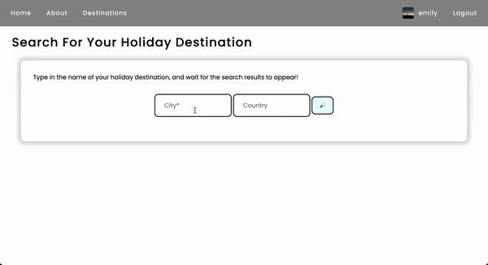

# Dynamic Web Scraper
This web scraper is a Python package that scrapes [Lonely Planet](https://www.lonelyplanet.com/) and the Internet Movie Database, [IMDb](https://www.imdb.com/), for information on world destinations and TV series **statically** (scraping a given page URL's contents) and **dynamically** (scraping the results dependent on a search term, to then scrape the chosen (by user) search result's page). 

The script calls a class whose methods have been unit- and integration-tested. The tests are kept together in a single package to simplify the running of all tests and to improve reusability of any pytest configurations and fixtures across all tests.


## Dynamic Web Scraper in Action
Two of my previous projects have made use of this scraper, when it was less robust (untested at the time): [Holistars](https://github.com/emilydaykin/Holistars-Server) and [ISDb](https://github.com/emilydaykin/Internet-Series-Database-API). ISDb only uses the static scraper to seed data, whilst Holistars uses both the static scraper (to seed the database) and the dynamic scraper (to search, return, then add results to the database).

The idea behind the dynamic scraper is that, through a UI and using the Lonely Planet scraper example, a user can search keywords on an application, which will run the dynamic search script, return the corresponding results' URLs under the hood, then run the static scraper on each of those URLs to display the results visually back to the user. For example (authenticated users on the [Holistars app](https://holistars.netlify.app/) can dynamically scrape a holiday destination to add):

<p align='center'>
  
</p>

**The equivalent keyword ('ko') search on Lonely Planet yields *all* results (not filtered to Thailand)**
<p align='center'>
  
</p>


## Tech Stack
- Language and Testing: Python, Pytest (with fixtures & `capsys`)
- Libraries: BeautifulSoup, requests, unidecode


## Installation
1. Clone this repo 
2. Run tests: Run `pytest` in the root directory
3. Run the scraper: Run `python src/runners/<file_name>.py` in the root directory
    - `python src/runners/imdb.py`, or
    - `python src/runners/lonely_planet.py`

#### ⚠️ Note:
- IMDb and Lonely Planet may change their HTML class names or ids. The tag names in this package are correct as of 22/06/2022.
- This scraper (and tests) must be run from an English-speaking country (or use a VPN). If running this scraper in Spain for example, the test below will fail (even if the IMDB page displays the English title):
  ```
  # $src/scraper/tests/test_scraper/test_dynamic_scraper
  assert scraped_series_page[0]['name'] == 'Game of Thrones' 
  # FAIL on Assertion Error: 'Juego de Tronos' ≠ 'Game of Thrones'
  ```


## Architecture
#### Project File Structure
```
src
├── data
│   ├── destinations.py
│   └── series.py
├── runners
│   ├── imdb.py
│   └── lonely_planet.py
└── scraper
    ├── __init__.py
    ├── dynamic_scraper.py
    └── tests
        ├── __init__.py
        ├── conftest.py
        ├── pytest.ini
        └── test_scraper
            ├── __init__.py
            ├── test_data_conversions.py
            ├── test_dynamic_scraper.py
            └── test_static_scraper.py
```
#### Scraper Class Structure
```
class Scraper:
    """ Dynamic and static scraper for Lonely Planet and IMDb, as well as static
        methods to convert or export scraped data into a readable/usable format.
    """
    def __init__(self):
        ...

    def scrape_lonely_planet_cities(self, urls: List[str] = URLs_lonely_planet) -> List[dict]:
        """ Method that statically scrapes a given list of Lonely Planet pages for
            destination name, country, state, continent, description, top attractions
            and an image URL.
            Returns a list of dictionaries per destination URL.
        """
        ...

    def scrape_lonely_planet_search(self, city_name: str, country_name: str) -> List[str]:
        """ Method that dynamically scrapes the search results page of Lonely Planet
            given a search term. The results are then matched to the country_name
            arg to narrow down to the relevant search results.
            Returns a list of Lonely Planet URLs corresponding to the relevant search results.
        """
        ...

    @staticmethod
    def _extract_years(years) -> object:
        """ Helper function to extract pilot and finale years from IMDB show. """
        ...

    def scrape_imdb_series(self, urls: List[str] = URLs_imdb) -> List[dict]:
        """ Method that statically scrapes a given list of IMDB pages for TV series
            title, genres, plot, actors, pilot and finale year, average rating, image
            URL, number of episodes and language of the show.
            Returns a list of dictionaries per show URL.
        """
        ...

    def scrape_imdb_search(self, search_term: str) -> List[str]:
        """ Method that dynamically scrapes the search results page of IMDb
            given a search term. The results are then filtered to only 'titles'
            (ignoring results of 'names', 'keywords' or 'companies' on IMDb)
            to narrow down to the relevant search results.
            Returns a list of IMDb URLs corresponding to the relevant search results.
        """
        ...

    @staticmethod
    def _convert_scraped_results_to_json_file(data: List[dict], file_name: str):
        """ Exports a given list of dictionary data into a JSON file. """
        ...

    @staticmethod
    def _convert_scraped_results_to_dataframe(data: List[dict]) -> pd.DataFrame:
        """ Converts a given list of dictionary data into a pandas dataframe. """
        ...

    @staticmethod
    def _convert_scraped_results_to_csv_file(data: List[dict], file_name: str):
        """ Exports a given list of dictionary data into a CSV file. """
        ...

```


## Featured Code Snippets
#### Dynamic scraper of search results on Lonely Planet, using headers to bypass 403 errors
```
def scrape_lonely_planet_search(self, city_name: str, country_name: str) -> List[str]:
    """ Method that dynamically scrapes the search results page of Lonely Planet
        given a search term. The results are then matched to the country_name
        arg to narrow down to the relevant search results.

        Returns a list of Lonely Planet URLs corresponding to the relevant search results.
    """

    city_name = unidecode(city_name.lower())
    country_name = unidecode(country_name.lower())

    if requests.get(f'https://www.lonelyplanet.com/{country_name}/{city_name}').status_code == 200:
        city_url_to_scrape = f'https://www.lonelyplanet.com/{country_name}/{city_name}'
        return [city_url_to_scrape]

    # Bypassing Response [403] with headers:
    header = {
        'user-agent': 'Mozilla/5.0 (Windows NT 10.0; Win64; x64) AppleWebKit/537.36 (KHTML, like Gecko) '
                      'Chrome/74.0.3729.169 Safari/537.36',
        'referer': 'https://www.google.com/'
    }

    page = requests.get(
        f'https://www.lonelyplanet.com/search?q={city_name}', headers=header)
    soup = BeautifulSoup(page.content, 'html.parser')

    search_results = soup.find_all(
        'a', class_='text-sm md:text-xl font-semibold text-link line-clamp-1')
    if len(search_results) == 0:
        return ['']
    else:
        for result in search_results:
            # Filter to just country searched:
            if unidecode(result['href'].split('/')[0]) == country_name:
                self.cities_urls_to_scrape.append(
                    f"https://www.lonelyplanet.com/{result['href']}")

        return self.cities_urls_to_scrape
```
#### Static Method that converts scraped results to a CSV file
```
@staticmethod
def _convert_scraped_results_to_csv_file(data: List[dict], file_name: str):
    """ Exports a given list of dictionary data into a CSV file. """
    if type(data) == list and len(data) >= 1 and type(data[0]) == dict \
            and len(data[0].keys()) >= 7:
        keys = data[0].keys()  # extract keys as csv header

        with open(f"{file_name}.csv", 'w', newline='') as output_file:
            dict_writer = csv.DictWriter(output_file, keys)
            dict_writer.writeheader()
            dict_writer.writerows(data)

    else:
        raise TypeError('Data must be a valid list of dictionaries.')
```
#### Testing snippet using a fixture and capsys
```
def test_imdb_broken_url(invalid_url, capsys):
    """ Test that the IMDb scraper returns the correct error via
        the `except` block when a broken URL link is passed as an argument.
    """
    scraper = Scraper()
    try:
        scraper.scrape_imdb_series(invalid_url)
        out, err = capsys.readouterr()
        for error in ['HTTPSConnectionPool', 'port=443', 'Max retries exceeded',
                      'Caused by NewConnectionError']:
            assert error in out, f'Error DOES NOT contain "{error}"'
        assert err == ''
    except Exception as err:
        raise pytest.fail(f'DID RAISE {err}')
```
#### Integration test of the dynamic then static scraper
```
def test_dynamic_imdb_search(mock_imdb_search_term):
    """ Test that the IMDb dynamic scraper returns expected results. """
    scraper = Scraper()
    results = scraper.scrape_imdb_search(mock_imdb_search_term)
    assert type(results) == list, 'Results should be a list'
    assert len(results) > 3, 'There should be more than 3 results'  # this could change if the site changes
    assert 'tt0944947' in results[0]  # main Game of Thrones result

    scraped_series_page = scraper.scrape_imdb_series([results[0]])
    assert type(scraped_series_page) == list
    assert len(scraped_series_page) == 1
    expected_keys = [
        'name', 'genre', 'description', 'actors', 'pilotYear', 'finaleYear', 'rating', 'image'
    ]
    assert all(key in scraped_series_page[0].keys()
               for key in expected_keys), 'Key(s) missing.'
    assert scraped_series_page[0]['name'] == 'Game of Thrones'  # UK vpn (or else spanish title)
    assert scraped_series_page[0]['genre'] == ['Action', 'Adventure', 'Drama']
    assert len(scraped_series_page[0]['actors']) == 3
    assert int(scraped_series_page[0]['pilotYear']) == 2011
```


## Testing
Fixtures were used for mock data, and `capsys` to assert errors raised from a try-except block.
#### Overview:
```
============================= test session starts ==============================
platform darwin -- Python 3.9.11, pytest-7.1.2, pluggy-1.0.0
rootdir: ~/dynamic_web_scraper
collected 16 items

src/scraper/tests/test_scraper/test_data_conversions.py ....             [ 25%]
src/scraper/tests/test_scraper/test_dynamic_scraper.py ....              [ 50%]
src/scraper/tests/test_scraper/test_static_scraper.py ........           [100%]

============================= 16 passed in 20.62s ==============================
```
### Testing the Dynamic Scraper & Errors
```
============================= test session starts ==============================
collecting ... collected 4 items

test_dynamic_scraper.py::test_dynamic_imdb_search                        [ 25%]
test_dynamic_scraper.py::test_imdb_invalid_search                        [ 50%]
test_dynamic_scraper.py::test_dynamic_lonely_planet_search               [ 75%]
test_dynamic_scraper.py::test_lonely_planet_invalid_search               [100%]

============================== 4 passed in 11.95s ==============================
```
### Testing the Static Scraper & Errors
```
============================= test session starts ==============================
collecting ... collected 8 items

test_static_scraper.py::test_static_imdb                                 [ 12%]
test_static_scraper.py::test_imdb_year_split                             [ 25%]
test_static_scraper.py::test_imdb_year_split_error                       [ 37%]
test_static_scraper.py::test_imdb_invalid_scraper_url                    [ 50%]
test_static_scraper.py::test_imdb_broken_url                             [ 62%]
test_static_scraper.py::test_static_lonely_planet                        [ 75%]
test_static_scraper.py::test_lonely_planet_invalid_scraper_url           [ 87%] 
test_static_scraper.py::test_lonely_planet_broken_url                    [100%]

============================== 8 passed in 9.87s ===============================
```
### Testing Data Conversions & Errors
```
============================= test session starts ==============================
collecting ... collected 4 items

test_data_conversions.py::test_convert_to_json PASSED                    [ 25%]
test_data_conversions.py::test_convert_to_csv PASSED                     [ 50%]
test_data_conversions.py::test_convert_to_dataframe PASSED               [ 75%]
test_data_conversions.py::test_invalid_data_conversions PASSED           [100%]

============================== 4 passed in 0.76s ===============================
```